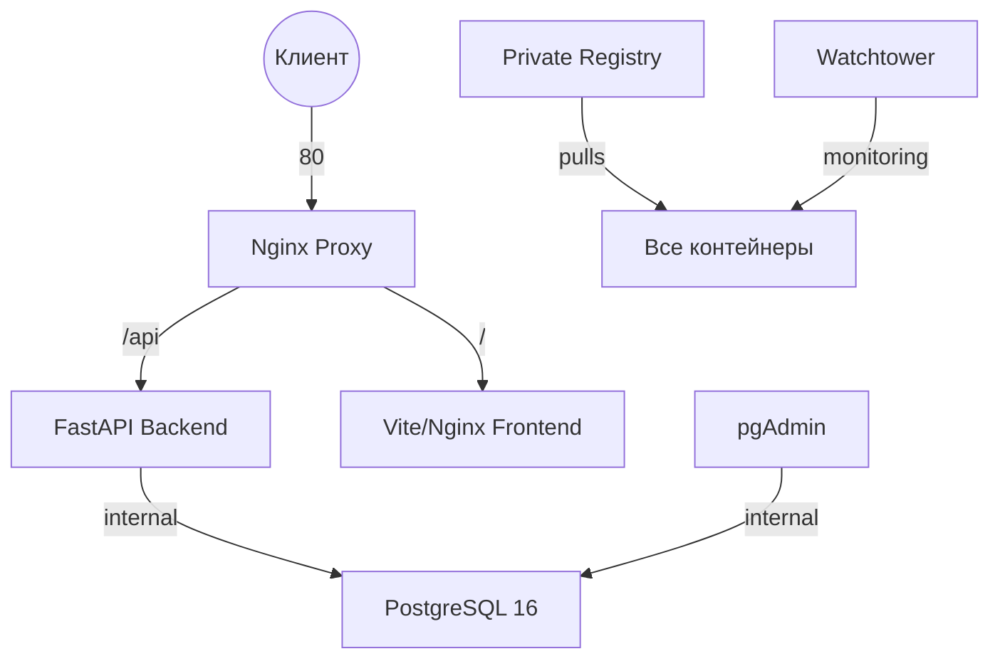

# Business Cloud Infrastructure

Проект по созданию облачной инфраструктуры с использованием Docker Compose, Nginx и системы автоматического обновления контейнеров (Watchtower).

## 🏗 Архитектура проекта

Система построена на принципах контейнеризации и автоматического деплоя через приватный реестр (Registry).



## 🛠 Компоненты

- **Nginx Proxy**: Единая точка входа, раздача фронтенда и проксирование API.
- **FastAPI Backend**: Основная логика приложения.
- **Vite Frontend**: Современный интерфейс пользователя.
- **PostgreSQL 16**: Хранилище данных.
- **Docker Registry**: Приватное хранилище образов на сервере.
- **Watchtower**: Автоматически обновляет запущенные контейнеры при пуше новых образов в реестр.

## 🚀 Деплой и обновления

Проект настроен на полуавтоматический деплой с вашего компьютера прямо на сервер.

### Использование Makefile (если установлен make):
```bash
make deploy
```

### Использование PowerShell (на Windows):
```powershell
./deploy.ps1
```

**Что происходит при запуске:**
1. Собирается фронтенд (`npm run build`).
2. Собираются Docker-образы.
3. Образы упаковываются и передаются на сервер через SSH-контекст.
4. Watchtower на сервере видит обновление и перезапускает контейнеры.

## 🔧 Настройка
1. Скопируйте `.env.example` в `.env` и укажите свои пароли.
2. Создайте файл аутентификации для реестра: `htpasswd -Bc auth/htpasswd admin`.
3. Настройте Docker Context для удаленного сервера:
   ```bash
   docker context create remote --docker "host=ssh://user@your-server-ip"
   ```

## 🔐 Безопасность
- Доступ к базе данных закрыт извне (только внутри внутренней сети Docker).
- Реестр защищен авторизацией Basic Auth.
- Деплой происходит через зашифрованное SSH-соединение.
