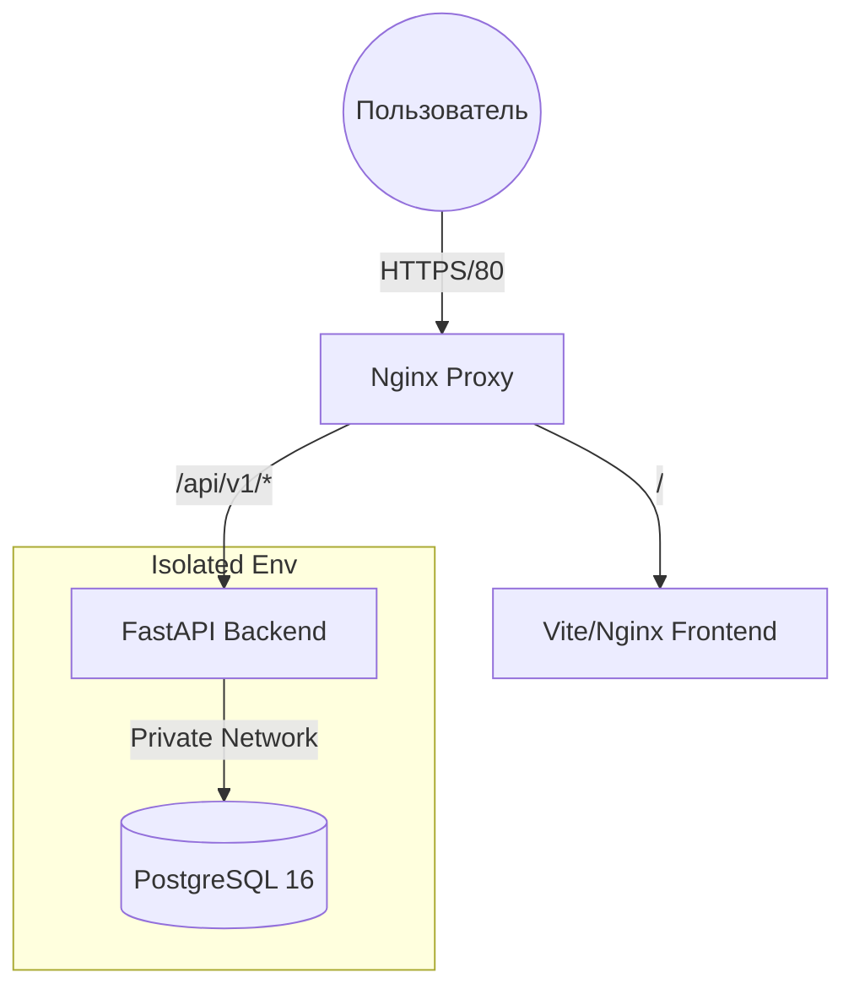

# Business Cloud Infrastructure & Smart CRM

Профессиональная облачная инфраструктура для обработки бизнес-процессов с встроенной умной CRM-системой, аналитикой поведения пользователей (тепловые карты мыши) и современным изолированным бэкендом.

## 🌟 Ключевые возможности

- **Smart Leads Analysis**: Интеллектуальный алгоритм скоринга "температуры" заявок от пользователей. Назначает горячим (📌 Срочно, 💰 Большой бюджет) и холодным лидам баллы и приоритеты, выводя рекомендации к действиям менеджеров.
- **Mouse Tracking Heatmaps**: Система записывает перемещения и клики пользователей на фронтенде в фоновом режиме, агрегирует базу на сервере, и показывает масштабируемые тепловые карты (Canvas) в Админ-панели (как в Яндекс.Метрике).
- **Responsive Admin Panel**: Красивый современный интерфейс управления услугами и лидами с использованием Glassmorphism и темных тем (Vanilla CSS + HTML5 + Vanilla JS).
- **Security First Architecture**: Бэкенд и база данных полностью изолированы в закрытой сети Docker (`internal: true`). Доступ к API возможен только через обратный прокси-сервер Nginx.

## 🏗 Архитектура проекта



## 🛠 Технологический стек

- **Backend**: Python 3.12, FastAPI, SQLAlchemy (Async), PostgreSQL 16.
- **Frontend**: Vite.js, Vanilla HTML/CSS/JS, CSS Canvas Rendering.
- **Deployment**: Docker Compose, Nginx.

## 🚀 Локальный запуск (Development)

Проект настроен на сборку через Docker Compose. Служебные контейнеры (PgAdmin, Registry, Watchtower) отключены по умолчанию для экономии памяти и безопасности.

### 1. Подготовка конфигурации
Скопируйте пример окружения и при необходимости измените доступы (особенно `JWT_SECRET_KEY` и системные пароли):
```bash
cp .env.example .env
```

### 2. Сборка фронтенда
Перед подъемом докера необходимо сбилдить Vite:
```bash
cd frontend
npm install
npm run build
cd ..
```

### 3. Запуск инфраструктуры
Поднимаем nginx (который уже включает в себя фронтенд), backend-api и базу данных:
```bash
docker compose up -d --build
```
* Сайт доступен по адресу: `http://localhost`
* Доступ к админке: `http://localhost/admin`

## 🚀 Деплой на сервер (Production)

Для профессионального деплоя в `docker-compose.yaml` предусмотрены закомментированные секции для автоматизации:

### 1. Автоматические обновления (Watchtower)
Watchtower мониторит ваш приватный Docker Registry и автоматически обновляет контейнеры при пуше новых образов.
- Раскомментируйте секцию `watchtower`.
- Для корректной работы с SSH/реестром установлена опция `network_mode: host`.
- Убедитесь, что папка `/root/.docker` (с конфигами аутентификации) смонтирована верно.

### 2. Приватный реестр (Registry)
Локальный реестр образов для быстрой доставки кода:
- Раскомментируйте секцию `registry`.
- По умолчанию настроен на `127.0.0.1:5000` для безопасности (доступ через туннель).
- Требует настройки `htpasswd` для авторизации.

## 🔐 Безопасность (DevSecOps)
- **Изоляция портов**: Контейнеры базы данных (`postgres`) и бекенда (`backend`) не имеют проброшенных портов наружу. Доступ только через внутренний `internal_net`.
- **PgAdmin**: Управление базой отключено из интерфейса для устранения площади атаки (Attack Surface). Рекомендуется подключаться к production базе данных через зашифрованный SSH Tunnel с помощью локального DBMS (DataGrip, DBeaver) на порт **5433**.
- **Bearer Token Auth**: Защита всех приватных `/admin/` эндпоинтов с помощью JWT токенов. При прямом запросе в браузер без токенов будет возвращена ошибка `401 Unauthorized`.
